# EatDiscounted — Data Flow Architecture

> NYC restaurant discount aggregator checking 10+ platforms for cashback, deals, and loyalty offers.

## Platform Summary

| Layer | Service |
|-------|---------|
| **Hosting** | Vercel |
| **Database** | Supabase PostgreSQL + SQLite (local persistent data) |
| **Auth** | None (anonymous, hashed IP for identity) |
| **Search** | Brave Search API (2,000 queries/mo free tier) |
| **Direct APIs** | Upside REST, Bilt Rewards REST, Rewards Network REST, Blackbird Sitemap |
| **Disk Cache** | JSON files (API dumps, prefetch cache) |
| **Background Jobs** | None (on-demand with aggressive caching) |

## Data Flow

```mermaid
flowchart TB
    subgraph Browser["🌐 Browser"]
        App["Next.js SPA\nSSE streaming results"]
    end

    subgraph Vercel["▲ Vercel"]
        Server["Next.js API Routes"]
    end

    subgraph DataLayer["💾 Data Layer"]
        SupabaseDB["Supabase PostgreSQL\n• reports (community)\n• favorites (per-device)"]
        SQLite["SQLite\n(local persistent data)"]
        DiskCache["Disk Cache\n• search-cache.json\n• bilt-nyc-restaurants.json\n• rewards-network-nyc.json\n• upside-nyc.json"]
        MemCache["In-Memory Cache\n• API results (1hr TTL)\n• Sitemap (5min TTL)\n• Rate limit buckets"]
    end

    subgraph DirectAPIs["🔌 Direct APIs (Tier 1)"]
        Blackbird["Blackbird\nSitemap XML\nblackbird.xyz/sm.xml"]
        Upside["Upside REST\nPOST /prod/offers/refresh\nNYC bounding box\n~196 offers"]
        Bilt["Bilt Rewards\nGET /public/merchants\n~2,237 restaurants\n(paginated)"]
        RewardsNet["Rewards Network\naadvantagedining.com\nMerchant search"]
    end

    subgraph BraveSearch["🔍 Brave Search (Tier 2)"]
        Brave["Brave Search API\n2,000 queries/mo\nsite:-scoped queries"]
        InKind["inKind"]
        TGTG["Too Good To Go"]
        RestCom["Restaurant.com"]
        Groupon["Groupon"]
        Rakuten["Rakuten Dining"]
        Nea["Nea"]
        Seated["Seated"]
    end

    App -->|"GET /api/check?q=restaurant"| Server
    Server -->|"SSE stream\nresults as found"| App

    Server -->|"parallel\ncheck"| Blackbird
    Server -->|"parallel\ncheck"| Upside
    Server -->|"parallel\ncheck"| Bilt
    Server -->|"parallel\ncheck"| RewardsNet

    Server -->|"batch search\n6 platforms"| Brave
    Brave -.->|"site:inkind.com"| InKind
    Brave -.->|"site:toogoodtogo.com"| TGTG
    Brave -.->|"site:restaurant.com"| RestCom
    Brave -.->|"site:groupon.com"| Groupon
    Brave -.->|"site:rakuten.com"| Rakuten
    Brave -.->|"site:nea.com"| Nea
    Brave -.->|"site:seated.com"| Seated

    Server <-->|"community reports\nfavorites"| SupabaseDB
    Server <-->|"local data"| SQLite
    Server <-->|"warm cache\nAPI dumps"| DiskCache
    Server <-->|"1hr TTL\nresult cache"| MemCache

    App -->|"POST /api/report\n(hashed IP)"| Server
    App -->|"POST /api/favorites\n(hashed IP+UA)"| Server

    style Browser fill:#e8f4fd,stroke:#2196F3
    style Vercel fill:#f5f5f5,stroke:#000
    style DataLayer fill:#e8f5e9,stroke:#4CAF50
    style DirectAPIs fill:#fff3e0,stroke:#FF9800
    style BraveSearch fill:#f3e5f5,stroke:#9C27B0
```

## Key Data Flows

1. **Restaurant Search**: User queries → parallel check: 4 direct APIs + Brave Search (6 platforms) → fuzzy string matching → SSE stream results back
2. **Caching Waterfall**: In-memory (1hr) → disk cache (JSON dumps) → live API call → cache result
3. **Community Reports**: User clicks "I found it here" → hashed IP (SHA-256) → Supabase `reports` table (unique per reporter+restaurant+platform)
4. **Favorites**: User saves restaurant → hashed IP+UA identity → Supabase `favorites` table
5. **Browse by Neighborhood**: Precomputed from API dump JSON → grouped by NYC neighborhood (zip mapping) → paginated

## API Quota Management

| API | Quota | Strategy |
|-----|-------|----------|
| **Brave Search** | 2,000/mo free | Prefetch top 500 restaurants; 1hr cache; direct APIs reduce search load |
| **Upside** | Undocumented | Full NYC bbox cached 1hr (single call serves all lookups) |
| **Bilt** | Undocumented | Full catalog cached 1hr (paginated download) |
| **Rewards Network** | Undocumented | Per-restaurant cached 1hr |
| **Blackbird** | Undocumented | Sitemap cached 5min |
